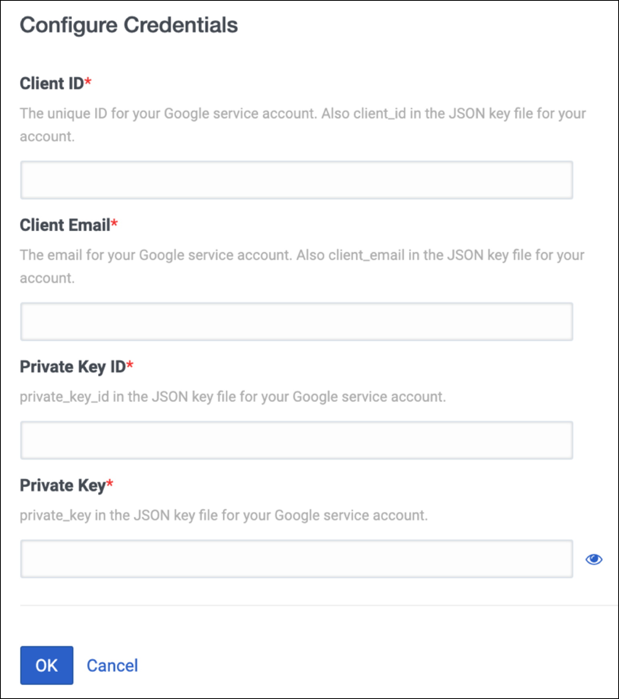
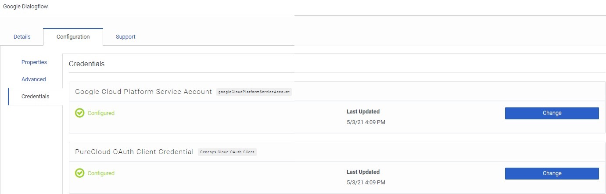

This Genesys Cloud Blueprint explains how to build a rapid response voice and chat bot for Genesys Cloud using Google DialogFlow. The blueprint uses the Covid-19 Agent Template, which enables government agencies and healthcare organizations to provide up-to-date information to the public and helps businesses to provide critical company-specific information related to COVID-19 to their customers. It also includes the initial templates that you require to set up COVID-19 Google Virtual Agent immediately.

* [Solution components](#solution-components "Goes to the Solution components section")
* [Prerequisites](#prerequisites "Goes to the Prerequisites section")
* [Implementation steps](#implementation-steps "Goes to the Implementation steps section")
* [Additional resources](#additional-resources "Goes to the Additional resources section")

## Solution Components

* **Genesys Cloud** - A suite of Genesys cloud services for enterprise-grade communications, collaboration, and contact center management. You configure Architect flows in Genesys Cloud.
* **Google Dialogflow** - Dialogflow is a natural language understanding platform that makes it easy to design and integrate a conversational user interface into your mobile app, web application, device, bot, interactive voice response system, and so on.

## Prerequisites
### Genesys Cloud account

* A Genesys Cloud license. For more information, see [Genesys Cloud pricing](https://www.genesys.com/pricing "Opens the Genesys Cloud pricing page").
* An Integration permission. For more information, see [Roles and permissions overview](https://help.mypurecloud.com/?p=24360 "Opens the Roles and permissions overview article") in the Genesys Cloud Resource Center.
* Google DialogFlow integration. To enable Dialogflow for your Genesys Cloud organization, visit [AppFoundry](https://appfoundry.genesys.com/filter/purecloud/listing/43a28e86-6158-4f86-b705-0b7471e24cfe).

### Google DialogFlow account
* A DialogFlow service account. To set up a new account, see [DialogFlow](https://dialogflow.com/ "Opens the Google DialogFlow page").

## Implementation Steps

- [Create a virtual agent in Dialogflow](#create-a-virtual-agent-in-dialogflow "Opens the Create a virtual agent in Dialogflow section")
- [Create and manage the service account in Google Cloud](#create-and-manage-the-service-account-in-google-cloud "Opens the Create and manage the service account in Google Cloud")
- [Create an OAuth client in Genesys Cloud for Dialogflow](#create-an-oauth-client-in-genesys-cloud-for-dialogflow "Opens the Create an OAuth client in Genesys Cloud for Dialogflow")
- [Add the integration for Google Dialogflow](#add-the-integration-for-google-dialogflow "Opens the Add the integration for Google Dialogflow")
- [Download the COVID Rapid Response flows](#download-the-covid-rapid-response-flows "Opens the Download the COVID Rapid Response flows section")
- [Enable the COVID-19 voice bot for Genesys Cloud](#enable-the-covid-19-voice-bot-for-genesys-cloud "Opens the Enable the COVId-19 voice bot for Genesys Cloud")
- [Enable the COVID-19 chat bot for Genesys Cloud](#enable-the-covid-19-chat-bot-for-genesys-cloud "Opens the Enable the COVID-19 chat bot for Genesys Cloud")
- [Create and test the widget in Genesys Cloud](#create-and-test-the-widget-in-genesys-cloud "Opens the Create and test the widget in Genesys Cloud")
  
### Create a virtual agent in Dialogflow
1. Download the ```covid-19-agent-template.zip``` and  ```dialogflow-fulfillment.zip``` files from [here](https://github.com/GenesysCloudBlueprints/dialogflow-rapid-response-virtual-agent-blueprint/tree/main/blueprint/attachments).

2. Create a virtual agent in Dialogflow using the following steps from [here](https://cloud.google.com/dialogflow/es/docs/tutorials/covid19-rapid-response "Opens the Rapidly build and deploy a virtual agent using Dialogflow templates in Dialogflow documentation"). The example shows how to use the template ```covid-19-agent-template```, which enables you to program chat or voice bots with the latest COVID-19 responses.

   

:::primary
**Note**: Make a note of the Project ID of the agent in Dialogflow.
:::

### Create and manage the service account in Google Cloud
1. Create a service account in Google Cloud platform following the steps from [here](https://cloud.google.com/iam/docs/creating-managing-service-accounts "Opens the Creating and managing service accounts in Google Cloud documentation") and ensure that the service account has the Dialogflow API Client and Dialogflow API Admin roles.

2. Create and download the service account key in JSON format as described [here](https://cloud.google.com/iam/docs/creating-managing-service-account-keys "Opens the Creating service account keys in Google Cloud documentation").

:::primary
**Note**: The JSON file for service account contains the ```client_id```, ```client_email```, ```private_key``` and ```private_key_id```.
:::

### Create an OAuth client in Genesys Cloud for Dialogflow
1. In Genesys Cloud, navigate to **Admin** > **OAuth** and click **Add Client**.
2. Create an OAuth client with the following options:
   1. Enter a name for the client and select **Client Credentials** as the Grant Type.
   2. Click the **Roles** tab and assign the following roles:
      1. admin
      2. employee


3. Click **Save** and copy the **Client ID** and **Client Secret** fields.

### Add the integration for Google Dialogflow
1. In Genesys Cloud, select **Admin** > **Integrations** and click the **+Integrations** icon.
2. Search for Google Dialogflow integration. 
If Google Dialogflow is not in the list, then go to [AppFoundry](https://appfoundry.genesys.com/filter/genesyscloud/listing/43a28e86-6158-4f86-b705-0b7471e24cfe "Opens the AppFoundry page") and click **Enable** and go back to step 1.
3. Install the Google Dialogflow integration.


4. Enter the App Name as Google Dialogflow.
5. In the Configuration tab, select **Credentials**.
6. In the Google Cloud Platform Service Account section, click **Configure** and enter the following details from the service account key saved from Google Cloud platform:
   1. Client ID - ```client_id```
   2. Client Email - ```client_email```
   3. Private Key ID - ```private_key_id```
   4. Private Key - ```private_key```



7. In the Genesys Cloud OAuth Client Credential section, click **Configure** and enter the following details from the OAuth client credentials created for Google Dialogflow:
   1. Client ID
   2. Client Secret

8. In the Details tab, toggle the option from Inactive to Active.
9.  Verify that the integration is active and click **Save**.

### Download the COVID Rapid Response flows
Download the [COVID Rapid Response](https://github.com/GenesysCloudBlueprints/dialogflow-rapid-response-virtual-agent-blueprint/blob/main/blueprint/attachments/COVID-19_Rapid_Response_Flow.zip?raw=true "Opens the GitHub repository of Covid Rapid Response flow zip") flow from the GitHub repository. Unzip the ZIP file and you can see two flows named ```i3InboudFlow``` and ```i3InboundChatFlow```.

### Enable the COVID-19 voice bot for Genesys Cloud
You can implement the COVID-19 voice bot as a new flow or add to one of your existing Architect flows. 

**New flow**

1. In Genesys Cloud, navigate to **Admin** > **Architect**.
2. In the Architect, select **Inbound Call** under Flows and click **Add**.
3. Enter a name for the flow and click **Create Flow**.
4. Click the **Save** drop down list and select **Import**.
5. Select the ```i3InboundFlow``` file and click **Import**.
6. Click the **Call Dialogflow Bot** action highlighted in red in the flow.
7. Under Dialogflow Agent, select the Dialogflow agent that you created in the Google Cloud Platform.


8. Click **Publish** to make the flow available for use.

**Update an existing flow**

1. In Genesys Cloud, navigate to **Admin** > **Architect**.
2. In the Architect, select an existing flow and click **Edit**.
3. Either open the task from where you want to call the bot or if you want access the bot from a menu, drag a **Task** from the **Toolbox**, assign DTMF or Speech Recognition from Settings, and then open the task.
4. In the Toolbox, select Data and drag the action **Call Dialogflow Bot** to the editor.
5. Configure the **Dialogflow Agent**. Select the agent that you created in the Google Cloud Platform with the imported COVID-19 bot.
6. Click **Publish** to make the updated flow available for use.

### Enable the COVID-19 chat bot for Genesys Cloud

Implement the COVID-19 chat bot as a new flow or within one of your existing flows.

**New flow**

1. In Genesys Cloud, navigate to **Admin** > **Architect**.
2. In the Architect, select **Inbound Chat** under Flows and click **Add**.
3. Enter a name for the flow and click **Create Flow**.
4. Click the **Save** drop down list and choose **Import**.
5. Select the ```i3InboundChatFlow``` file and click **Import**.
6. Click the **Call Dialogflow Bot** action highlighted in red.
7. Configure the Dialogflow Agent of the bot action. Select the Dialogflow agent that you created in the Google Cloud Platform.


8. Click **Publish** to make the flow available for use.

**Update an existing flow**

1. In Genesys Cloud, navigate to **Admin** > **Architect**.
2. In the Architect, select an existing flow and click **Edit**.
3. Either open the task from where you want to call the bot or if you want access the bot from a menu, drag a `Task` from the `Toolbox`, assign DTMF or Speech Recognition from Settings, and then open the task.
4. In the Toolbox, select Data and drag the action **Call Dialogflow Bot** to the editor.
5. Configure the **Dialogflow Agent** of the bot action. Select the agent that you created in the Google Cloud Platform with the imported COVID-19 bot.
6. Click **Publish** to make the updated flow available for use.

### Create and test the widget in Genesys Cloud
1. In Genesys Cloud, navigate to **Contact Center** > **Widgets** and click **Create Widget**.
2. Enter a name for the widget.
3. Select **Version 1.1** as the Widget Type.
4. To connect the widget to a chat flow, select the chat flow that you created under **Route to Flow**.
5. Copy the **Generated Script Tag** created for the widget.
:::primary
**Note**: Use this tag in your web site to show the chat widget.
:::
6. Test the widget using the developer tool at https://developer.genesys.cloud/developer-tools/#/webchat
   1. Select the widget that you created in the Deployment drop down list.
   2. Populate the **Chat Data** fields and click **Start Chart**.

Learn more about how to create a widget for web chat [here](images/chat-with-rapid-response-agent.jpg "Chat with Rapid Response Agent").


## Additional resources
* [COVID-19 Rapid Response Virtual Agent | Genesys Cloud - eLearning](https://gened.genesys.com/learn/course/internal/view/elearning/11782/covid-19-rapid-response-virtual-agent-genesys-cloud-elearning)
* [DevCast: How to Build a Google Rapid Response Virtual Assistant with Genesys Cloud](https://www.youtube.com/watch?v=hvPVYHzc6_8)
* [Configure the Google DialogFlow Integration](https://help.mypurecloud.com/articles/configure-the-google-dialogflow-platform-service-account-credential/)