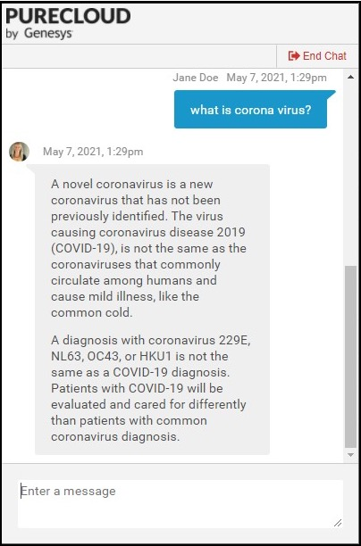

This Genesys Cloud Developer Blueprint provides instructions for building a rapid response chat bot for Genesys Cloud using Google DialogFlow. This guide will use the Covid-19 Agent Template as an example, this template enables government agencies and healthcare organizations to provide up-to-date information to the public, and ensure businesses can provide critical company-specific info related to COVID-19 to their customers. This offer includes the initial template you need to COVID-19 Google Virtual Agent immediately.

* [Solution components](#solution-components "Goes to the Solution components section")
* [Prerequisites](#prerequisites "Goes to the Prerequisites section")
* [Implementation steps](#implementation-steps "Goes to the Implementation steps section")

## Solution Components

* **Genesys Cloud** - A suite of Genesys cloud services for enterprise-grade communications, collaboration, and contact center management. You configure Architect flows in Genesys Cloud.
* **Google DialogFlow** - Dialogflow is a natural language understanding platform that makes it easy to design and integrate a conversational user interface into your mobile app, web application, device, bot, interactive voice response system, and so on.

## Prerequisites
### Genesys Cloud account

* A Genesys Cloud license. For more information, see [Genesys Cloud Pricing](https://www.genesys.com/pricing "Opens the Genesys Cloud pricing page") in the Genesys website.
* An Integration permission. For more information, see [Roles and permissions overview](https://help.mypurecloud.com/?p=24360 "Opens the Roles and permissions overview article") in the Genesys Cloud Resource Center.
* Google DialogFlow integration. To enable for your Genesys Cloud organization, visit [AppFoundry](https://appfoundry.genesys.com/filter/purecloud/listing/43a28e86-6158-4f86-b705-0b7471e24cfe).

### Google DialogFlow account
* A DialogFlow service account. To setup a new account, see [DialogFlow](https://dialogflow.com/ "Opens the Google DialogFlow page").

## Implementation Steps

* [Download the Google Dialogflow Bot](#download-google-dialogflow-bot "Goes to the Download the Google Dialogflow Bot section")
* [Enable Google Dialogflow in Genesys Cloud](#enable-google-dialogflow-in-genesys-cloud "Goes to the Enable Google Dialogflow in Genesys Cloud section")
* [Enable the COVID-19 Voice Bot for Genesys Cloud](#enable-the-covid-19-voice-bot-for-genesys-cloud "Goes to the Enable the COVID-19 Voice Bot for Genesys Cloud section")
* [Enable the COVID-19 Chat Bot for Genesys Cloud](#enable-the-covid-19-chat-bot-for-genesys-cloud "Goes to the Enable the COVID-19 Chat Bot for Genesys Cloud section")

### Download Google Dialogflow Bot
1. Download the following zip files [here](https://github.com/GenesysCloudBlueprints/dialogflow-rapid-response-virtual-agent-blueprint/tree/main/blueprint/attachments):
   - covid-19-agent-template.zip
   - dialogflow-fulfillment.zip
2. In the Google Cloud Platform console, create a new Dialogflow agent. For more information, see [Build an agent from scratch](https://cloud.google.com/dialogflow/es/docs/tutorials/build-an-agent) in DialogFlow.
   
3. Import the COVID-19 agent template in Google Dialogflow.
   
4. Note the service account assigned to the Dialogflow agent.
5. In the Google Cloud Platform IAM, ensure the service account has the `Dialogflow API Client` and `Dialogflow API Admin` roles.
   
6. Download the service account details in the JSON format. These will be used in the next step.
:::primary
**Note**: Google's Rapidly build and deploy a virtual agent using Dialogflow templates is located [here](https://cloud.google.com/dialogflow/docs/tutorials/covid19-rapid-response).
:::

### Enable Google Dialogflow in Genesys Cloud
1. Create an OAuth Client within your Genesys Cloud organization (Admin > OAuth > Add Client (+)) with the following options:
   - App Name = Google DialogFlow
   - Type = Client Credentials
   - Roles = Admin and Employee
   - Click `Save` and note the `Client ID` and `Client Secret` fields.
   
2. Install the Google Dialogflow integration.
   - Option 1: Admin > Integrations > Add New (+)
   - Option 2: Enable on AppFoundry [here](https://appfoundry.genesys.com/filter/genesyscloud/listing/43a28e86-6158-4f86-b705-0b7471e24cfe).
   
3. In Admin > Integrations > Google Dialogflow, navigate to the Configuration tab, sub-option Credentials:
   - In the `Google Cloud Platform Service Account Credential` section, click `Change` and input the following information from the service account JSON downloaded previously:
     - Client ID (JSON field: `client_id`)
     - Client Email (JSON field: `client_email`)
     - Private Key ID (JSON field: `private_key_id`)
     - Private Key (JSON field: `private_key`)
   - In the `Genesys Cloud OAuth Client Credential` section, click `Change` and input the newly created `Client ID` and `Client Secret` values from item 1 above.
   
4. Click the Details tab, toggle from `Inactive` to `Active`, and click `Save`.

### Enable the COVID-19 Voice Bot for Genesys Cloud
The COVID-19 bot can be implemented as a brand new flow, or within one of your existing Architect flows.

1. Navigate to Architect in your Genesys Cloud organization.
   - Admin > Architect
2. To use the COVID-19 bot as a new flow:
   - [Download](https://github.com/GenesysCloudBlueprints/dialogflow-rapid-response-virtual-agent-blueprint/blob/main/blueprint/attachments/COVID-19_Rapid_Response_Flow.zip?raw=true) the ZIP file containing a pre-built flow.
   - In Architect, choose `Inbound Call` click `Add`, give the flow a name, and click `Create Flow`.
   - Click the caret down next to the Save button, choose Import, select the `i3InboundFlow` file extracted from the ZIP downloaded, and click `Import`.
   - If there is a red `Call Dialogflow Bot` block, click on it, and under Dialogflow Agent, select the agent you created in the Google Cloud Platform console with the imported COVID-19 bot.
   - Click `Publish` to make the flow available for use.
   - Now, you can select this flow in Genesys Cloud Admin > Routing > Call Routing to assign an inbound phone number.
3. To update an existing Architect flow with the COVID-19 bot:
   - In Architect, open an existing flow and enter `Edit` mode.
   - Open the task you would like to call the bot from. If you would like the bot to be accessed from a menu, drag in a `Task` from the `Toolbox`, assign a DTMF or speech utterance, and choose `Click to open` to open the task.
   - In the `Toolbox`, under `Data`, drag in the sub-item `Call Dialogflow Bot`.
   - Under Dialogflow Agent, select the agent you created in the Google Cloud Platform console with the imported COVID-19 bot.
   - Click `Publish` to make the updated flow available for use.

### Enable the COVID-19 Chat Bot for Genesys Cloud
The COVID-19 bot can be implemented as a brand new flow, or within one of your existing Architect flows.

1. Navigate to Architect in your Genesys Cloud organization.
   - Admin > Architect
2. To use the COVID-19 bot as a new flow:
   - [Download](https://github.com/GenesysCloudBlueprints/dialogflow-rapid-response-virtual-agent-blueprint/blob/main/blueprint/attachments/COVID-19_Rapid_Response_Flow.zip?raw=true) the ZIP file containing a pre-built flow.
   - In Architect, choose `Inbound Chat` and click `Add`, give the flow a name, and click `Create Flow`.
   - Click the caret down next to the Save button, choose Import, select the `i3InboundChatFlow` file extracted from the ZIP downloaded, and click `Import`.
   - If there is a red `Call Dialogflow Bot` block, click on it, and under Dialogflow Agent, select the agent you created in the Google Cloud Platform console with the imported COVID-19 bot.
   - Click `Publish` to make the flow available for use.
3. To update an existing Architect flow with the COVID-19 bot:
   - In Architect, open an existing flow and enter `Edit` mode.
   - Open the task you would like to call the bot from. If you would like the bot to be accessed from a menu, drag in a `Task` from the `Toolbox`, assign a DTMF or speech utterance, and choose `Click to open` to open the task.
   - In the `Toolbox`, under `Data`, drag in the sub-item `Call Dialogflow Bot`.
   - Under Dialogflow Agent, select the agent you created in the Google Cloud Platform console with the imported COVID-19 bot.
   - Click `Publish` to make the updated flow available for use.
4. Create a widget deployment:
   - In Contact Center > Widgets, click `Create Widget`
   - Select **Version 1.1** as the `Widget Type`
   - Select the `Flow` you have just created in the `Route to Flow` field
   - Take note of the `Generated Script Tag` as this will be the syntax you will need to put in your site to show the chat widget.
     - Click here to know how to [Create a widget for web chat](https://help.mypurecloud.com/articles/create-a-widget-for-web-chat/)
   - You can now test using the rapid response agent in the [Developer Tools](/developer-tools/#/webchat)
     - Choose the `Widget` you have just created in the `Deplyoment` drop down
     - Populate the `Chat Data` fields and click `Start Chat`

## Additional resources
* [COVID-19 Rapid Response Virtual Agent | Genesys Cloud - eLearning](https://gened.genesys.com/learn/course/internal/view/elearning/11782/covid-19-rapid-response-virtual-agent-genesys-cloud-elearning)
* [DevCast: How to Build a Google Rapid Response Virtual Assistant with Genesys Cloud](https://www.youtube.com/watch?v=hvPVYHzc6_8)
* [Configure the Google DialogFlow Integration](https://help.mypurecloud.com/articles/configure-the-google-dialogflow-platform-service-account-credential/)