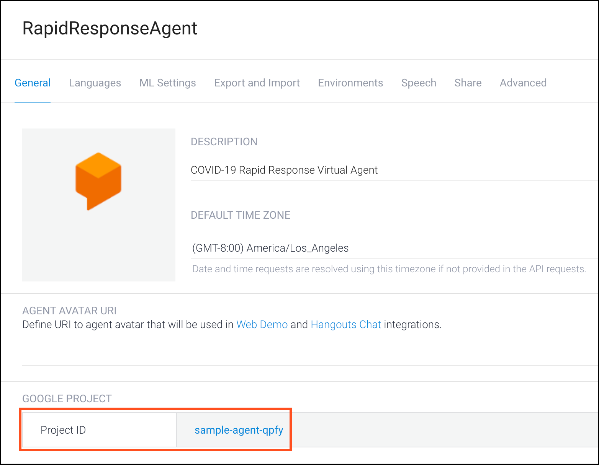
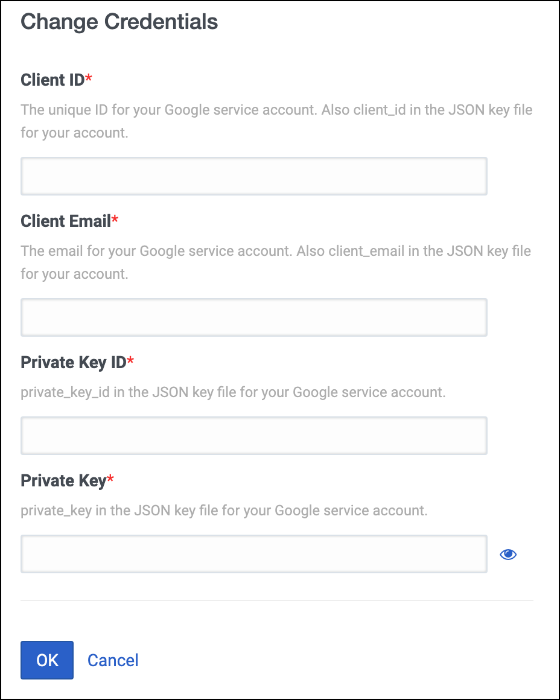
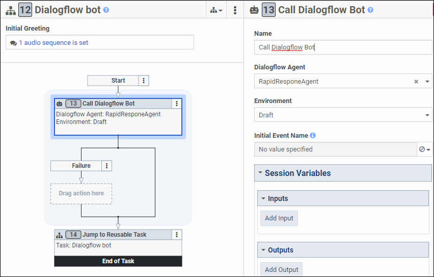

This Genesys Cloud Developer Blueprint explains how to build a rapid response voice and chat bot in Genesys Cloud using Google Dialogflow. The voice and chat bot can conduct screenings and answer frequently asked questions about COVID-19. The blueprint demonstrates the use of the COVID-19 virtual agent template, which enables government agencies and healthcare organizations to provide up-to-date information to the public and helps businesses provide critical company-specific information related to COVID-19 to their customers. 

* [Solution components](#solution-components "Goes to the Solution components section")
* [Prerequisites](#prerequisites "Goes to the Prerequisites section")
* [Implementation steps](#implementation-steps "Goes to the Implementation steps section")
* [Additional resources](#additional-resources "Goes to the Additional resources section")

## Solution Components

* **Genesys Cloud** - A suite of Genesys cloud services for enterprise-grade communications, collaboration, and contact center management. You configure Architect flows, data actions, and outbound campaigns in Genesys Cloud.
* **Architect flow** - A flow in Architect, a drag and drop web-based design tool, dictates how Genesys Cloud handles inbound or outbound interactions.
* **Google Dialogflow** - Dialogflow is a natural language understanding platform that makes it easy to design and integrate a conversational user interface into your mobile app, web application, device, bot, interactive voice response system, and so on. Dialogflow enables you to provide new and engaging ways for users to interact with your product.

## Prerequisites
### Genesys Cloud account

* A Genesys Cloud license. For more information, see [Genesys Cloud pricing](https://www.genesys.com/pricing "Opens the Genesys Cloud pricing page").
* The roles of Master Admin and Employee. For more information, see [Roles and permissions overview](https://help.mypurecloud.com/?p=24360 "Opens the Roles and permissions overview article") in the Genesys Cloud Resource Center.
* Google Dialogflow integration. To enable Dialogflow for your Genesys Cloud organization, visit [AppFoundry](https://appfoundry.genesys.com/filter/purecloud/listing/43a28e86-6158-4f86-b705-0b7471e24cfe "Opens the AppFoundry page").

### Google Dialogflow account
* A Dialogflow service account. To set up a new account, see [Dialogflow](https://dialogflow.com/ "Opens the Google Dialogflow page").

## Implementation Steps

- [Create a virtual agent in Dialogflow](#create-a-virtual-agent-in-dialogflow "Opens the Create a virtual agent in Dialogflow section")
- [Create and manage the service account in Google Cloud](#create-and-manage-the-service-account-in-google-cloud "Opens the Create and manage the service account in Google Cloud")
- [Create an OAuth client in Genesys Cloud for Dialogflow](#create-an-oauth-client-in-genesys-cloud-for-dialogflow "Opens the Create an OAuth client in Genesys Cloud for Dialogflow")
- [Add the integration for Google Dialogflow](#add-the-integration-for-google-dialogflow "Opens the Add the integration for Google Dialogflow")
- [Download the COVID Rapid Response flows](#download-the-covid-rapid-response-flows "Opens the Download the COVID Rapid Response flows section")
- [Enable the COVID-19 voice bot for Genesys Cloud](#enable-the-covid-19-voice-bot-for-genesys-cloud "Opens the Enable the COVID-19 voice bot for Genesys Cloud")
- [Enable the COVID-19 chat bot for Genesys Cloud](#enable-the-covid-19-chat-bot-for-genesys-cloud "Opens the Enable the COVID-19 chat bot for Genesys Cloud")
- [Create and test the widget in Genesys Cloud](#create-and-test-the-widget-in-genesys-cloud "Opens the Create and test the widget in Genesys Cloud")
  
### Create a virtual agent in Dialogflow
   
1. Create a virtual agent in Dialogflow. For more information, see [Rapidly build and deploy a virtual agent using Dialogflow templates](https://cloud.google.com/dialogflow/es/docs/tutorials/covid19-rapid-response "Opens the Rapidly build and deploy a virtual agent using Dialogflow templates in the Dialogflow documentation") in the Dialogflow documentation. The example in the linked procedure shows how to use the ```covid-19-agent-template``` file, which enables you to program chat or voice bots with the latest COVID-19 responses.

   

:::primary
**Note**: Make a note of the Google Project ID of the virtual agent in Dialogflow. You require this Project ID when you create a service account in Google Cloud.
:::

### Create and manage the service account in Google Cloud
1. Create a service account in the Google Cloud platform. For more information, see [Creating and managing service accounts](https://cloud.google.com/iam/docs/creating-managing-service-accounts "Opens the Creating and managing service accounts in Google Cloud documentation") in the Google Cloud documentation. Select the Google project created while creating the virtual agent. Ensure that the service account has the Dialogflow API Client and Dialogflow API Admin roles.

2. Create and download the service account key. For more information, see [Creating service account keys](https://cloud.google.com/iam/docs/creating-managing-service-account-keys "Opens the Creating service account keys in Google Cloud documentation") in the Google Cloud documentation. Create the key type in JSON format.

:::primary
**Note**: The JSON file for the service account contains the ```client_id```, ```client_email```, ```private_key```, and ```private_key_id```.
:::

### Create an OAuth client in Genesys Cloud for Dialogflow
1. In Genesys Cloud, navigate to **Admin** > **OAuth** and click **Add Client**.
2. Create an OAuth client with the following options:
   1. Enter a name for the client and select **Client Credentials** as the Grant Type.
   2. Click the **Roles** tab and assign the following roles:
      - admin
      - employee


3. Click **Save** and note the **Client ID** and **Client Secret** fields to use in a subsequent task.

### Add the integration for Google Dialogflow
1. In Genesys Cloud, select **Admin** > **Integrations** and click the **+Integrations** icon.
2. Search for Google Dialogflow integration. 
If Google Dialogflow is not in the list, then go to [AppFoundry](https://appfoundry.genesys.com/filter/genesyscloud/listing/43a28e86-6158-4f86-b705-0b7471e24cfe "Opens the AppFoundry page") and click **Enable**, then go back to Step 1.
3. Install the Google Dialogflow integration.


4. Enter the App Name as Google Dialogflow.
5. In the Configuration tab, select **Credentials**.
6. In the Google Cloud Platform Service Account section, click **Configure** and enter the following details from the service account key saved from the Google Cloud platform:
   1. Client ID - ```client_id```
   2. Client Email - ```client_email```
   3. Private Key ID - ```private_key_id```
   4. Private Key - ```private_key```



7. In the Genesys Cloud OAuth Client Credential section, click **Configure** and enter the following details from the OAuth client credentials created for Google Dialogflow:
   - Client ID
   - Client Secret

   Click **OK**.

8. In the **Details** tab, toggle the option from **Inactive** to **Active**.
9. Verify that the integration is active and then click **Save**.

### Download the COVID Rapid Response flows
Download the [COVID Rapid Response](https://github.com/GenesysCloudBlueprints/dialogflow-rapid-response-virtual-agent-blueprint/blob/main/blueprint/attachments/COVID-19_Rapid_Response_Flow.zip?raw=true "Opens the GitHub repository of COVID Rapid Response flow zip"), which is stored in the GitHub repository for this blueprint. Unzip the ZIP file, which contains two flows ```i3InboudFlow``` and ```i3InboundChatFlow```.  Use these flows to create the voice and chat bots.

### Enable the COVID-19 voice bot for Genesys Cloud
You can implement the COVID-19 voice bot as a new flow or add it to one of your existing Architect flows. 

**New flow**

1. In Genesys Cloud, navigate to **Admin** > **Architect**.
2. From the Architect home page, click the **Flows** menu and select **Inbound Call**.
3. Click **Add** and the Create Flow dialog box opens.
4. Enter a unique name for the flow and click **Create Flow**.
   The flow’s configuration page opens.
5. Click the arrow at the end of the **Save** menu and select **Import**.
   The Import a flow dialog box opens.
6. Select the ```i3InboundFlow``` file and click **Import**.
7. Click the **Call Dialogflow Bot** action highlighted in red in the flow.
8. Under **Dialogflow Agent**, select the Dialogflow agent that you created in the Google Cloud platform.

   

9.  Click **Publish** to make the flow available for use.

**Update an existing flow**

1. In Genesys Cloud, navigate to **Admin** > **Architect**.
2. From the Architect home page, click the **Flows** menu, select an existing flow, and then click **Edit**.
3. Either open the task from where you want to call the bot or if you want access the bot from a menu, drag a **Task** from the **Toolbox**, assign **DTMF or Speech Recognition** from **Settings**, and then open the task.
4. From the **Toolbox**, select **Data** and drag the **Call Dialogflow Bot** action to the editor.
5. Under **Dialogflow Agent**, select the agent that you created in the Google Cloud platform.
6. Click **Publish** to make the updated flow available for use.

### Enable the COVID-19 chat bot for Genesys Cloud

Implement the COVID-19 chat bot as a new flow or add it to one of your existing flows.

**New flow**

1. In Genesys Cloud, navigate to **Admin** > **Architect**.
2. From the Architect home page, click the **Flows** menu, select **Inbound Chat**.
3. Click **Add** and the Create Flow dialog opens.
4. Enter a unique name for the flow and click **Create Flow**.
   The flow’s configuration page opens.
5. Click the arrow at the end of the **Save** menu and select **Import**.
6. Select the ```i3InboundChatFlow``` file and click **Import**.
7. Click the **Call Dialogflow Bot** action highlighted in red.
8. Configure the Dialogflow Agent of the bot action. Select the Dialogflow agent that you created in the Google Cloud platform.

   

9.  Click **Publish** to make the flow available for use.

**Update an existing flow**

1. In Genesys Cloud, navigate to **Admin** > **Architect**.
2. From the Architect home page, select an existing flow and click **Edit**.
3. Either open the task from where you want to call the bot or if you want access the bot from a menu, drag a **Task** from the **Toolbox**, assign **DTMF or Speech Recognition** from **Settings**, and then open the task.
4. From the **Toolbox**, select **Data** and drag the **Call Dialogflow Bot** action to the editor.
5. Configure the **Dialogflow Agent** of the bot action. Under **Dialogflow Agent**, select the agent that you created in the Google Cloud platform.
6. Click **Publish** to make the updated flow available for use.

### Create and test the web chat widget in Genesys Cloud
1. In Genesys Cloud, navigate to **Contact Center** > **Widgets** and click **Create Widget**.
2. Enter a name for the widget.
3. Select **Version 1.1** as the Widget Type.
4. In the **Route to Flow** field, choose the flow that you created for COVID rapid response.
5. Click **Save**.
6. Copy the **Generated Script Tag** created for the widget.

   :::primary
   **Note**: To show the chat widget in your web site, use this Generated Script tag. For more information about adding the Version 1.1 widget and deployment key to your website, see [Web chat](https://developer.genesys.cloud/api/digital/webchat/ "Opens the Web chat page").
   :::
7. From your browser, open the Web Chat developer tool at https://developer.genesys.cloud/developer-tools/#/webchat. For more information, see [Web Chat developer tool quick start](https://developer.genesys.cloud/guides/quickstarts/developer-tools-web-chats "Opens the Web Chat developer tool quick start page").
8. From the **Deployment** menu in the Web Chat developer tool, select the chat widget you created.
9. From the **Queue** menu, select the appropriate queue.
10. Click **Start Chat** to test your chat bot solution.


For more information about how to create a widget for web chat, see [Create a widget for web chat](https://help.mypurecloud.com/?p=195772 "Opens the Create a widget for web chat article") in the Genesys Cloud Resource Center.

## Additional resources
* [COVID-19 Rapid Response Virtual Agent](https://gened.genesys.com/learn/course/internal/view/elearning/11782/covid-19-rapid-response-virtual-agent-genesys-cloud-elearning) in the Genesys Cloud eLearning. 
* [DevCast: How to Build a Google Rapid Response Virtual Assistant with Genesys Cloud](https://www.youtube.com/watch?v=hvPVYHzc6_8) in the YouTube channel of Genesys Online Community.
* [Configure the Google Dialogflow Integration](https://help.mypurecloud.com/?p=205970) in the Genesys Cloud Resource Center.